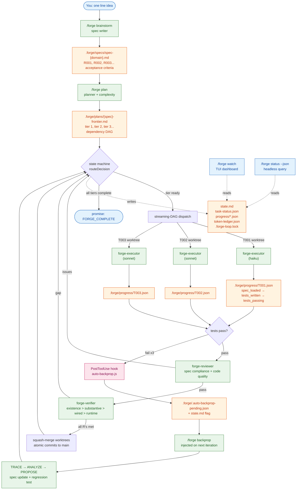

<p align="center">
  <picture>
    <source media="(prefers-color-scheme: dark)" srcset="https://raw.githubusercontent.com/LucasDuys/forge/main/docs/assets/forge-banner-dark.svg">
    <source media="(prefers-color-scheme: light)" srcset="https://raw.githubusercontent.com/LucasDuys/forge/main/docs/assets/forge-banner-light.svg">
    
  </picture>
</p>

<h3 align="center">One idea in. Tested, reviewed, committed code out.</h3>

<p align="center">
  <a href="https://github.com/LucasDuys/forge/blob/main/LICENSE"></a>
  <a href="https://github.com/LucasDuys/forge/stargazers"></a>
  <a href="https://github.com/LucasDuys/forge/releases"></a>
  <a href="https://github.com/LucasDuys/forge/tree/main/docs"></a>
  <a href="https://lucasduys.github.io/forge/"></a>
</p>

<p align="center">
  <a href="https://lucasduys.github.io/forge/">Watch the architecture video</a>
  &nbsp;·&nbsp;
  <a href="docs/">Read the docs</a>
</p>

---

You start a feature in Claude Code. You write the prompt. It writes the code. You review it. You re-prompt. It tries again. It loses context. You re-explain. You watch the "context: 87%" warning crawl up. You restart. You re-explain again. You're three hours in, you have half a feature, and you're the one keeping the whole thing from falling apart.

You are the project manager. You are the state machine. You are the glue.

**Forge replaces you as the glue.** You describe what you want in one line. Forge writes the spec, plans the tasks, runs them in parallel git worktrees with TDD, reviews the code, verifies it against the acceptance criteria, and commits atomically. You read the diffs in the morning.

## Install

Requires Claude Code v1.0.33+. Zero npm install, zero build step, zero dependencies.

```bash
claude plugin marketplace add LucasDuys/forge
claude plugin install forge@forge-marketplace
```

## Three commands to ship a feature

```bash
/forge brainstorm "add rate limiting to /api/search with per-user quotas"
/forge plan
/forge execute --autonomy full
```

Then walk away.

## What you actually see

```
$ /forge brainstorm "add rate limiting to /api/search with per-user quotas"

[forge-speccer] generating spec from idea...
spec written: .forge/specs/spec-rate-limiting.md
  R001  per-user quotas, configurable per tier (free / pro / enterprise)
  R002  sliding window counters (1 minute, 1 hour, 1 day)
  R003  429 response with Retry-After header
  R004  bypass for admin tokens
  R005  redis-backed counters with atomic increment
  R006  structured logs for rate-limit events
  R007  integration test against /api/search

$ /forge plan

[forge-planner] decomposing into task DAG...
8 tasks across 3 tiers (depth: standard)
  T001  add redis client + connection pool          [haiku, quick]
  T002  implement sliding window counter            [sonnet, standard]
  T003  build rate-limit middleware                 [sonnet, standard]
  T004  wire middleware to /api/search route        [haiku, quick]
  T005  add 429 response with Retry-After           [haiku, quick]
  T006  admin token bypass                          [haiku, quick]
  T007  structured logging                          [haiku, quick]
  T008  integration test                            [sonnet, standard]
        deps: T001 T002 T003 T004 T005 T006 T007

$ /forge execute --autonomy full

[14:02:11Z] lock acquired (pid 18432)
[14:02:11Z] T001 worktree created -> .forge/worktrees/T001/
[14:02:11Z] T001 executing  haiku  budget 5000
[14:02:48Z] T001 PASS       4 lines  1 commit  budget 1820/5000
[14:02:48Z] T002 executing  sonnet  budget 15000
[14:02:48Z] T003 executing  sonnet  budget 15000   (parallel, no file conflict)
[14:04:33Z] T002 PASS       37 lines  5 tests  budget 11240/15000
[14:06:01Z] T003 PASS       62 lines  8 tests  budget 13880/15000
[14:06:01Z] T004 T005 T006 T007 dispatched in parallel
[14:08:27Z] tier 2 complete  squash-merged 6 worktrees
[14:08:27Z] T008 executing  sonnet  budget 15000
[14:14:12Z] T008 PASS       44 lines  12 tests  budget 12300/15000
[14:14:12Z] forge-verifier: existence > substantive > wired > runtime
[14:14:18Z] verifier PASS  all 7 requirements satisfied
[14:14:18Z] <promise>FORGE_COMPLETE</promise>

8 tasks. 12 minutes. 218 lines. 9 commits squash-merged to main.
session budget: 47200 / 500000 used. lock released.
```

You read the diffs. You merge the branch. You move on.

## How it works under the hood

The whole loop is a state machine that lives inside your Claude Code session. One line in, tested and verified code out. Here is what actually happens between the prompt and the commit:



### What each piece does

**The state machine** (`scripts/forge-tools.cjs::routeDecision`) is the brain. Every time Claude tries to exit, the Stop hook calls it, asks "what's next given the current `.forge/state.md`?", and either feeds back a new prompt to keep going or lets Claude exit clean. There are 12 phases (idle, executing, reviewing_branch, verifying, budget_exhausted, conflict_resolution, recovering, lock_conflict, …) and the router knows every transition between them.

**Streaming-DAG dispatch** is how parallel tasks happen. The frontier file is a DAG with tier numbers; the router calls `findAllUnblockedTasks(tasks, forgeDir)` and gets back every task whose dependencies are satisfied. Up to `parallelism.max_concurrent_agents` (default 3) of those run simultaneously, each in its own git worktree at `.forge/worktrees/{task-id}/`. Worktrees mean failed tasks can be discarded without touching your main branch and successful ones squash-merge atomically.

**Per-task checkpoints** at `.forge/progress/{task-id}.json` track progress through 10 steps: `spec_loaded → research_done → planning_done → implementation_started → tests_written → tests_passing → review_pending → review_passed → verification_pending → complete`. If your machine crashes mid-task, `/forge resume` reads the checkpoint and picks up at the exact step where it died — no re-running tests that already passed.

**Model routing** sends each agent to the cheapest model that can handle its job. `forge-complexity` always runs on haiku. `forge-executor` runs on haiku for "quick" tasks, sonnet for "standard", opus for "thorough" — controlled by per-role baselines in `.forge/config.json`. `forge-speccer` and `forge-reviewer` start at sonnet because spec quality drives everything downstream.

**Auto-backprop** is the new bug → spec-gap loop. When the `hooks/auto-backprop.js` PostToolUse hook sees a test failure during executor runs, it captures the failure context, writes `.forge/.auto-backprop-pending.json`, and flips a flag in `state.md`. The TUI dashboard's `BACKPROP` banner lights up immediately. On the next iteration, the Stop hook prepends an `AUTO-BACKPROP TRIGGERED` directive to the routed prompt — the executor pauses the current task, runs the 5-step backprop workflow (TRACE → ANALYZE → PROPOSE → GENERATE → LOG), updates the spec, generates a regression test, then resumes. The flag is deleted atomically so the same failure never re-fires. Opt out with `auto_backprop: false` in config or `FORGE_AUTO_BACKPROP=0` env.

**The TUI dashboard** (`/forge watch`) doesn't write any state — it only reads. It polls `state.md`, `task-status.json`, every running task's `progress/{id}.json`, the lock file, and the token ledger on a 500ms interval, then renders a 5-region ANSI frame at 10Hz. When more than one task is running, a `── Parallel ──` panel shows one row per task with its agent, current step, and live token cost vs per-task budget. Zero npm install — pure Node built-ins and ANSI sequences.

**The headless mode** (`/forge status --json` or `node scripts/forge-tools.cjs headless query --json`) is the same data as the TUI but as a single JSON snapshot in under 5ms. Drop it into a Prometheus exporter, a Grafana dashboard, or a `--watch` polling loop. 17 fields, schema versioned at 1.0, zero LLM calls.

**Crash recovery** uses three layers: a lock file with 30-second heartbeat (5-minute stale threshold) prevents two sessions from racing on the same project, per-step checkpoints let resume restart inside a task at the exact step, and `performForensicRecovery()` reconstructs state from the lock + checkpoints + git log even if `state.md` itself is corrupted.

The whole thing is one Node-and-bash codebase with no npm install, no build step, and no external services. State lives in markdown and JSON files under `.forge/`. Every commit is atomic. Every test runs in 2.4 seconds.

## Why it works

- **Native Claude Code plugin.** Lives in your existing session. No separate harness, no TUI to learn, no API key to manage. ([architecture](docs/architecture.md))
- **Hard token budgets.** Per-task and per-session ceilings, enforced as hard stops, not warnings. No more silent overruns at 3am. ([budgets](docs/budgets.md))
- **Git worktree isolation.** Every task runs in its own worktree. Failed tasks get discarded. Successful ones squash-merge with atomic commit messages. Your main branch only ever sees green code. ([worktrees](docs/worktrees.md))
- **Crash recovery that actually works.** Lock file with heartbeat, per-step checkpoints, forensic resume from git log. If your machine reboots mid-feature, `/forge resume` picks up exactly where it died. ([recovery](docs/recovery.md))
- **Headless mode for CI and cron.** Proper exit codes, JSON state queries in under 5ms, zero interactive prompts. ([headless](docs/headless.md))
- **Goal-backward verification.** The verifier checks the spec, not the tasks. Existence > substantive > wired > runtime. Catches stubs, dead code, and "looks done but isn't" before they ship. ([verification](docs/verification.md))
- **Backpropagation, automatic.** When the executor's PostToolUse hook detects a test failure, `/forge backprop` runs automatically on the next iteration — tracing the failure to a spec gap, proposing a spec update, and generating a regression test before the failure ever reaches you. Opt out with `auto_backprop: false` in `.forge/config.json` or set `FORGE_AUTO_BACKPROP=0`. ([backprop](docs/backpropagation.md))
- **Self-updating.** `/forge update` pulls the latest Forge from upstream — git checkouts are fast-forwarded with dirty-tree protection, marketplace installs get manual instructions. Cross-platform git binary resolution so it works on Windows out of the box.
- **Live dashboard, optional.** `/forge watch` runs the same loop with an interactive TUI showing the active agent, current tool, frontier progress, token meters, and a scrolling event log. Zero npm install — pure Node built-ins and ANSI. Falls back to the plain runner automatically if your terminal can't render it. ([dashboard](docs/dashboard.md))

## Receipts

- **100 tests, 0 dependencies.** Full suite runs in 2.4 seconds. Pure `node:assert`.
- **Headless state query: under 5ms.** Zero LLM calls. Drop it in a Prometheus exporter.
- **Caveman compression: 26.8% reduction** on internal artifacts. ([benchmark](docs/benchmarks/caveman-integration.md))
- **Lock heartbeat survives** crashes, reboots, OOMs, and context resets. Five minute stale threshold, never auto-deletes user work.
- **Worktree isolation:** failed tasks never touch your main branch. Successful ones land as one squashed commit with a structured message.
- **Seven specialized agents.** Speccer, planner, researcher, executor, reviewer, verifier, complexity scorer. Each routed to the cheapest model that can handle the job. ([agents](docs/agents.md))
- **Seven circuit breakers.** Test failures, debug exhaustion, review iterations, no-progress detection, token ceilings. Nothing runs forever. ([circuit breakers](docs/verification.md))

## How it compares

Forge is one of three tools in this space alongside [Ralph Loop](https://ghuntley.com/ralph/) and [GSD-2](https://github.com/taches-org/gsd). They overlap but optimize for different things:

- Pick **Forge** if you want autonomous execution that lives inside your existing Claude Code session, with hard cost controls, adaptive depth, and crash recovery.
- Pick **GSD-2** if you want a more battle-tested standalone TUI harness with more engineering hours behind it.
- Pick **Ralph Loop** if you have a tightly-scoped greenfield task with binary verification and want the absolute minimum infrastructure.

Full honest comparison with all the trade-offs: [docs/comparison.md](docs/comparison.md).

## Documentation

- [Architecture](docs/architecture.md) — three-tiered loop, self-prompting engine, execution flow
- [Commands](docs/commands.md) — every slash command and flag
- [Configuration](docs/configuration.md) — `.forge/config.json` reference
- [Token budgets](docs/budgets.md) — per-task and session ceilings
- [Worktree isolation](docs/worktrees.md) — how each task gets its own branch
- [Crash recovery](docs/recovery.md) — forensic resume from checkpoints
- [Headless mode](docs/headless.md) — CI/cron usage and JSON schema
- [Specialized agents](docs/agents.md) — the seven roles and their model routing
- [Verification & circuit breakers](docs/verification.md) — goal-backward verification, the seven safety nets
- [Backpropagation](docs/backpropagation.md) — bugs to spec gaps
- [Caveman optimization](docs/caveman.md) — internal token compression
- [Live dashboard](docs/dashboard.md) — `/forge watch` interactive TUI
- [Testing](docs/testing.md) — running the 100-test suite
- [Comparison](docs/comparison.md) — Forge vs Ralph Loop vs GSD-2

## Credits

- **Caveman skill** adapted from [JuliusBrussee/caveman](https://github.com/JuliusBrussee/caveman) (MIT)
- **Ralph Loop pattern** by [Geoffrey Huntley](https://ghuntley.com/ralph/) — Forge's self-prompting loop is a smarter-state-machine variant
- **Spec-driven development** concepts from GSD v1 by TÂCHES
- **Claude Code plugin system** by Anthropic — Forge is a native extension, not a wrapper

## Contributing

1. Fork the repository
2. Create a feature branch
3. Make your changes
4. Run tests: `node scripts/run-tests.cjs`
5. Open a pull request

See [CONTRIBUTING.md](CONTRIBUTING.md).

## License

[MIT](LICENSE)
