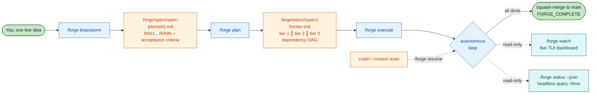
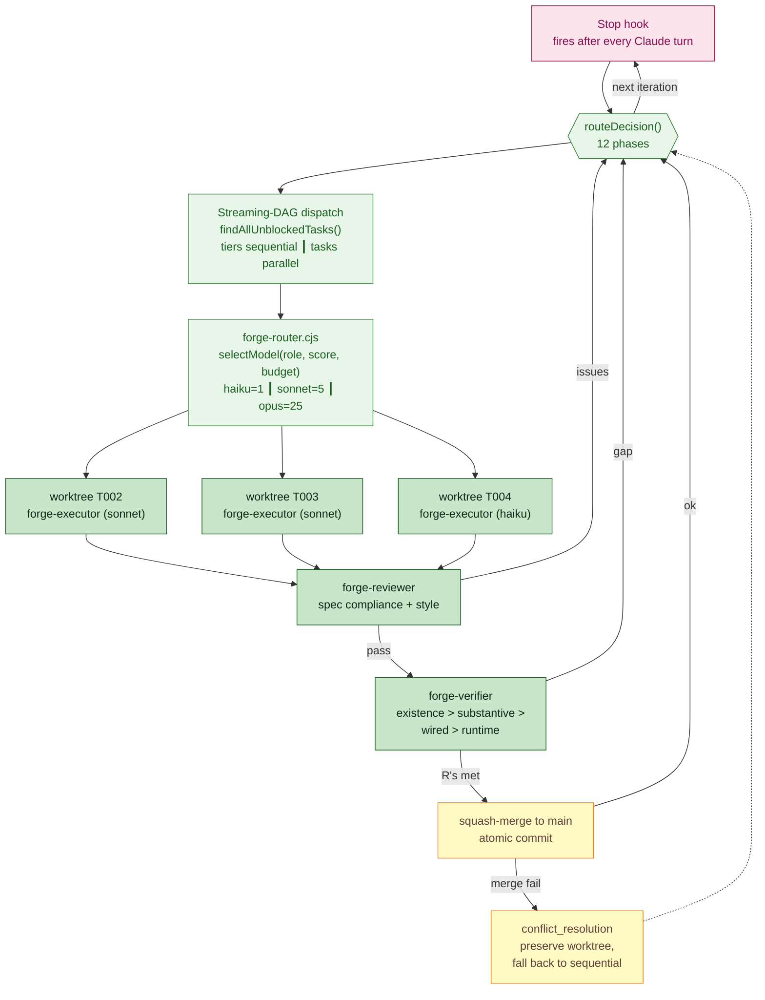
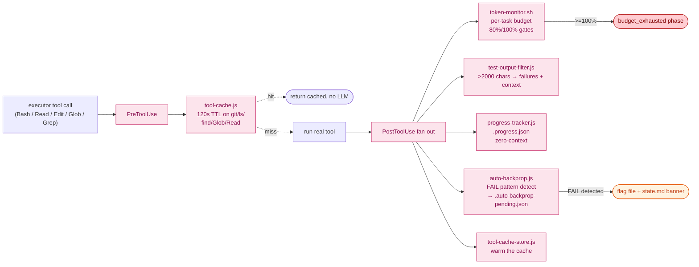
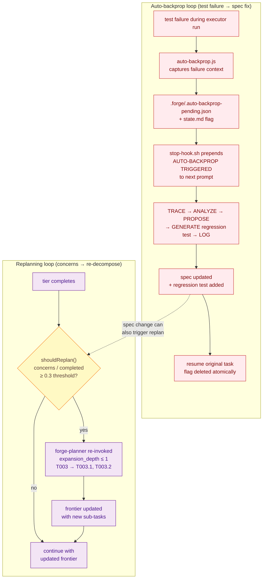
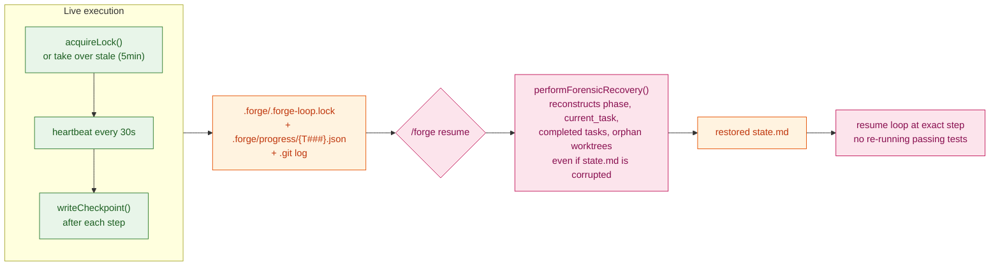
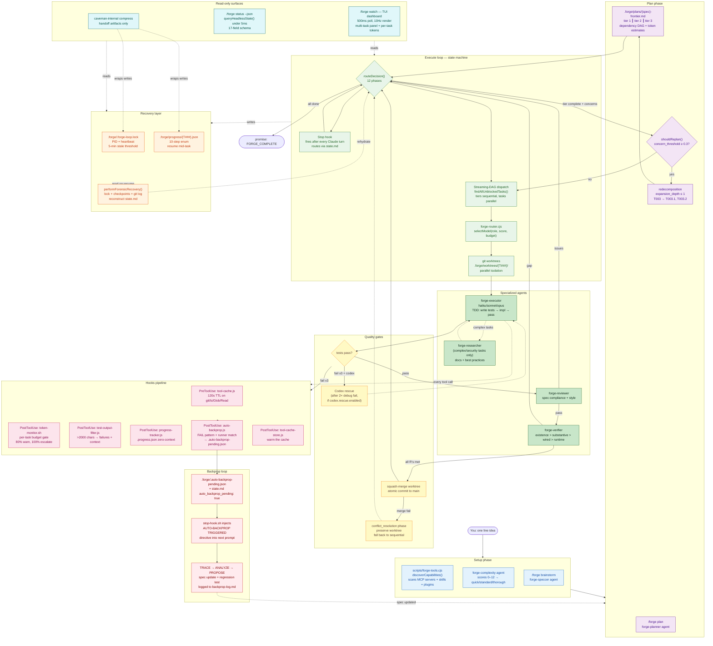

<p align="center">
  <picture>
    <source media="(prefers-color-scheme: dark)" srcset="https://raw.githubusercontent.com/LucasDuys/forge/main/docs/assets/forge-banner-dark.svg">
    <source media="(prefers-color-scheme: light)" srcset="https://raw.githubusercontent.com/LucasDuys/forge/main/docs/assets/forge-banner-light.svg">
    
  </picture>
</p>

<h3 align="center">One idea in. Tested, reviewed, committed code out.</h3>

<p align="center">
  <a href="https://github.com/LucasDuys/forge/blob/main/LICENSE"></a>
  <a href="https://github.com/LucasDuys/forge/stargazers"></a>
  <a href="https://github.com/LucasDuys/forge/releases"></a>
  <a href="https://github.com/LucasDuys/forge/tree/main/docs"></a>
  <a href="https://lucasduys.github.io/forge/"></a>
</p>

<p align="center">
  <a href="https://lucasduys.github.io/forge/">Watch the architecture video</a>
  &nbsp;·&nbsp;
  <a href="docs/">Read the docs</a>
</p>

---

You start a feature in Claude Code. You write the prompt. It writes the code. You review it. You re-prompt. It tries again. It loses context. You re-explain. You watch the "context: 87%" warning crawl up. You restart. You re-explain again. You're three hours in, you have half a feature, and you're the one keeping the whole thing from falling apart.

You are the project manager. You are the state machine. You are the glue.

**Forge replaces you as the glue.** You describe what you want in one line. Forge writes the spec, plans the tasks, runs them in parallel git worktrees with TDD, reviews the code, verifies it against the acceptance criteria, and commits atomically. You read the diffs in the morning.

## Install

Requires Claude Code v1.0.33+. Zero npm install, zero build step, zero dependencies.

```bash
claude plugin marketplace add LucasDuys/forge
claude plugin install forge@forge-marketplace
```

## Three commands to ship a feature

```bash
/forge brainstorm "add rate limiting to /api/search with per-user quotas"
/forge plan
/forge execute --autonomy full
```

Then walk away.

## v0.2.0: Guardrails, Knowledge Graphs, Design Systems

Three new cross-cutting skills that make Forge smarter about what it builds, how it plans, and how it reviews.

### Karpathy Guardrails

Behavioral principles from [andrej-karpathy-skills](https://github.com/forrestchang/andrej-karpathy-skills) baked into every agent. Four rules enforced across the entire pipeline:

1. **Think Before Coding** -- Surface ambiguity before guessing. Flag NEEDS_CONTEXT, not silent assumptions.
2. **Simplicity First** -- Build only what acceptance criteria require. No speculative features.
3. **Surgical Changes** -- Every changed line traces to a criterion. No adjacent improvements.
4. **Goal-Driven Execution** -- Verifiable success criteria before writing code.

The reviewer now flags violations of these principles as IMPORTANT issues.

### Graphify Integration

Optional [graphify](https://github.com/safishamsi/graphify) knowledge graph support. When `graphify-out/graph.json` exists:

- **Planner** aligns task boundaries with community clusters and orders by node connectivity
- **Researcher** queries the graph for architecture context before external docs
- **Reviewer** uses the graph for blast radius analysis
- **Executor** gets focused context (relevant subgraph) instead of the full codebase

Degrades gracefully -- no graph, no change in behavior.

### DESIGN.md Support

Design system integration inspired by [awesome-design-md](https://github.com/VoltAgent/awesome-design-md). When a project has a DESIGN.md:

- **Brainstorm** asks about design requirements and can generate DESIGN.md from brand catalogs
- **Planner** tags UI tasks with `design:` and adds design verification tasks
- **Executor** loads design tokens (colors, typography, spacing) as implementation constraints
- **Reviewer** runs a design compliance pass checking palette, typography, and spacing

## How it works under the hood

Forge is a state machine that lives inside your Claude Code session. Brainstorm a spec, plan a tier-ordered task DAG, then run an autonomous loop that dispatches parallel executors in git worktrees, gates each task through review and verification, and squash-merges atomically. Hooks watch every tool call to keep tokens in budget, condense test output, cache repeat reads, and trigger auto-backprop when test failures hit a spec gap. State files under `.forge/` are the single source of truth — the TUI dashboard and headless query both read them without writing. Crash recovery rebuilds state from the lock file + checkpoints + git log, so a kernel panic mid-feature is just a `/forge resume` away.

> **Reading the diagrams.** The five focused diagrams below each fit cleanly in GitHub's column width. GitHub renders Mermaid blocks with a "click to expand" button (top-right of the diagram) on most repos — use it for any diagram that still feels cramped. The full one-piece architecture diagram is at the bottom in a collapsible block for anyone who wants the holistic view.

### 1. The big picture

The end-to-end pipeline. Three commands, one autonomous loop, one merge.



### 2. The execute loop

What `/forge execute` actually runs. State machine drives everything; the Stop hook re-fires it after every Claude turn.



### 3. Hooks pipeline (every tool call)

Six hooks fire on every executor tool call. They keep the loop fast, cheap, and self-correcting.



### 4. Backprop + replanning loops

Two feedback loops that change what runs next based on what just happened.



### 5. Recovery layer

What survives when things go wrong. Three independent layers cooperate.



### Inside one task execution

The top-level diagram is a bird's-eye view. Here is what one task actually goes through, end to end:

```mermaid
flowchart LR
    Tier[Tier ready,<br/>task picked by router]
    Tier --> Acquire["acquireLock()<br/>or take over stale"]
    Acquire --> Worktree["createTaskWorktree()<br/>git worktree add"]
    Worktree --> CP1[".forge/progress/T###.json<br/>step: spec_loaded"]
    CP1 --> ResearchQ{"complex task?<br/>(unfamiliar/security)"}
    ResearchQ -->|yes| ResAgent[forge-researcher dispatch]
    ResearchQ -->|no| Plan2[plan internally]
    ResAgent --> CP2["step: research_done"]
    Plan2 --> CP3["step: planning_done"]
    CP2 --> CP3
    CP3 --> Impl["forge-executor writes code<br/>(model from forge-router)"]
    Impl --> CP4["step: implementation_started"]
    CP4 --> WriteTests["write tests (TDD)"]
    WriteTests --> CP5["step: tests_written"]
    CP5 --> RunTests["run tests via Bash"]
    RunTests --> Hooks2{"PostToolUse hooks fire"}
    Hooks2 --> TokGate["token-monitor: budget OK?"]
    Hooks2 --> Filt["test-output-filter: condense"]
    Hooks2 --> AutoBP2["auto-backprop: FAIL detected?"]
    TokGate -->|over| Exhaust([budget_exhausted])
    AutoBP2 -->|yes| FlagWrite[".auto-backprop-pending.json<br/>+ state.md flag"]
    FlagWrite -.->|next iter| BackpropFlow[backprop directive injected]
    RunTests --> Pass{"tests pass?"}
    Pass -->|no, retry x3| Impl
    Pass -->|fail x3 + codex| CodexRescue[Codex rescue agent]
    CodexRescue -.-> Impl
    Pass -->|yes| CP6["step: tests_passing"]
    CP6 --> ReviewQ["review queued"]
    ReviewQ --> CP7["step: review_pending"]
    CP7 --> Reviewer2[forge-reviewer]
    Reviewer2 --> ReviewPass{"review pass?"}
    ReviewPass -->|issues| Impl
    ReviewPass -->|pass| CP8["step: review_passed"]
    CP8 --> VerifyQ[verify queued]
    VerifyQ --> CP9["step: verification_pending"]
    CP9 --> Verifier2["forge-verifier:<br/>existence > substantive > wired > runtime"]
    Verifier2 --> VPass{"all R's met?"}
    VPass -->|gap| Impl
    VPass -->|pass| CP10["step: complete"]
    CP10 --> SquashMerge["completeTaskInWorktree()<br/>squash-merge to main"]
    SquashMerge --> Conflict2{"merge conflict?"}
    Conflict2 -->|yes| ConflictPhase[conflict_resolution phase]
    Conflict2 -->|no| Cleanup["delete worktree<br/>delete checkpoint<br/>release tier slot"]
    Cleanup --> Done2([next task or tier])

    classDef cp fill:#fff3e0,stroke:#e65100
    classDef agent fill:#c8e6c9,stroke:#1b5e20
    classDef gate fill:#fff9c4,stroke:#f57f17
    classDef bp fill:#ffebee,stroke:#c62828
    classDef bad fill:#ffcdd2,stroke:#b71c1c

    class CP1,CP2,CP3,CP4,CP5,CP6,CP7,CP8,CP9,CP10 cp
    class ResAgent,Impl,Reviewer2,Verifier2,CodexRescue agent
    class ResearchQ,Pass,ReviewPass,VPass,Hooks2,Conflict2 gate
    class FlagWrite,BackpropFlow bp
    class Exhaust,ConflictPhase bad
```



### Subsystem reference

| Subsystem | File | What it does |
|---|---|---|
| **State machine** | `scripts/forge-tools.cjs::routeDecision` | 12-phase router called by Stop hook every Claude turn. Drives the entire loop. |
| **Streaming-DAG dispatch** | `scripts/forge-tools.cjs::findAllUnblockedTasks` | Tiers run sequentially; tasks within a tier dispatch in parallel as separate agent calls within one session. |
| **Re-decomposition** | `scripts/forge-tools.cjs` (`shouldReplan` + `expansion_depth`) | When completed tasks have `complete_with_concerns` and the fraction crosses `concern_threshold` (0.3 default), the planner is re-invoked to add sub-tasks (T003 → T003.1, T003.2) up to `max_expansion_depth: 1`. **This is "streaming task updates that change the next tasks."** |
| **Model routing** | `scripts/forge-router.cjs::selectModel` | Per-role baselines (haiku/sonnet/opus) + task complexity score + budget state → model selection. Cost weights: haiku=1, sonnet=5, opus=25. |
| **Cost-weighted budget** | `scripts/forge-budget.cjs` | Tracks per-task and session token spend with per-model cost weights. Hard 100% gate, 80% warning. |
| **Capability discovery** | `scripts/forge-tools.cjs::discoverCapabilities` | Scans `.claude.json` MCP servers, `skills/`, plugin marketplaces; writes `.forge/capabilities.json`; agent prompts read it to recommend tools. |
| **Researcher agent** | `agents/forge-researcher.md` | Dispatched before complex/security/unfamiliar-tech tasks to produce a docs + best-practices report. Skipped for simple CRUD or test-only work. |
| **Codex rescue** | `scripts/forge-tools.cjs` (codex section) | After 2 consecutive debug failures, dispatches Codex with the failing context for an adversarial second opinion. Auto-detected from plugin cache. |
| **Caveman compression** | `skills/caveman-internal/SKILL.md` + `formatCavemanValue()` | Three intensity modes (lite/full/ultra) compress inter-agent handoff artifacts — state files, context bundles, review reports. **Excludes** source code, commits, specs. Saves 20-30% on internal tokens. |
| **Tool cache** | `hooks/tool-cache.js` + `tool-cache-store.js` | PreToolUse intercept + PostToolUse store with 120s TTL on read-only ops (`git status/log/diff/branch`, `ls`, `find`, `Glob`, `Grep`, `Read`). |
| **Token monitor** | `hooks/token-monitor.sh` | PostToolUse cheap token estimator. 80% per-task budget → warning. 100% → escalate to `budget_exhausted` phase. |
| **Test output filter** | `hooks/test-output-filter.js` | PostToolUse Bash matcher. For test commands >2000 chars (vitest/jest/pytest/cargo/go test/npm test/mocha), keeps failure blocks + 8 lines of context + summary tail. |
| **Progress tracker** | `hooks/progress-tracker.js` | Zero-context PostToolUse. Writes `.forge/.progress.json` with tool counts, commits, test runs, current phase/task. Stderr-only output. |
| **Auto-backprop** | `hooks/auto-backprop.js` + `hooks/stop-hook.sh` | PostToolUse Bash matcher detects test failures, captures context, writes `.forge/.auto-backprop-pending.json` and flips state.md flag. Stop hook injects `AUTO-BACKPROP TRIGGERED` directive into the next prompt; backprop runs the 5-step workflow before resuming the task. |
| **Lock file + heartbeat** | `scripts/forge-tools.cjs::acquireLock` / `detectStaleLock` | `.forge/.forge-loop.lock` with PID + heartbeat. 5-minute stale threshold. Stale locks are taken over automatically with a new PID. |
| **Checkpoints** | `scripts/forge-tools.cjs::writeCheckpoint` / `readCheckpoint` | `.forge/progress/{task-id}.json` tracks the 10-step enum. Each `forge-executor` step write is atomic; resume reads the latest. |
| **Forensic recovery** | `scripts/forge-tools.cjs::performForensicRecovery` | `/forge resume` runs this first. Reconstructs phase, current task, completed tasks, active checkpoints, and orphan worktrees from lock + checkpoints + git log even when state.md is missing or corrupted. |
| **Conflict resolution** | `scripts/forge-tools.cjs::completeTaskInWorktree` | Squash-merge fail → preserves the worktree, sets `phase: conflict_resolution`, falls back to sequential execution for the remaining tier. |
| **Verifier stages** | `agents/forge-verifier.md` | `existence > substantive > wired > runtime`. Checks artifacts exist, are not stubs (TODOs/empty fns/placeholders), are connected to the rest of the system, and pass acceptance criteria at runtime. |
| **TUI dashboard** | `scripts/forge-tui.cjs` (1359 lines, zero deps) | `/forge watch` reads state files on a 500ms poll and renders 5 regions + an optional `── Parallel ──` panel at 10Hz. **Read-only** — never writes state. |
| **Headless query** | `scripts/forge-tools.cjs::queryHeadlessState` | 17-field JSON snapshot in <100ms. Versioned 1.0. Used by TUI as primary data source AND by external monitors (Prometheus, Grafana, cron). |
| **`/forge update`** | `scripts/forge-update.cjs` | Self-update from upstream. Detects git checkout vs marketplace cache. Refuses dirty trees unless `--force`. Cross-platform git binary resolution. |

### What's new (since v2.1)

Forge could already do brainstorming, planning, autonomous execution, worktree isolation, lock-based crash recovery, headless mode, and manual backprop. Everything below is **new on top of that baseline** and shipped on `main` in this PR train (commits `601f3e9..4234ed0`):

| Capability | Before | Now |
|---|---|---|
| **Live status during `/forge execute`** | Plain text only — you see Claude's responses but not what's happening at the orchestration level | **Automatic status header** prepended to every iteration showing phase, task + step, agent, progress bar, tokens, per-task budget, lock — no second command, no separate window. Opt out via `execute.status_header: false` |
| **Fullscreen TUI dashboard** | None — only raw `claude --print` text | `/forge watch` runs forge in a separate process and renders an interactive 5-region ANSI dashboard at 10Hz with multi-task panel, lock status, transcript |
| **Multi-task visibility** | Single line of text per turn | `── Parallel ──` panel showing one row per running task with id, agent, current step, and live token cost vs per-task budget |
| **Per-task token cost** | Only session-wide token count | Status line shows `12.4k/15k tok (83%)` with 70/90 color thresholds; token line shows `task-tot Nk` summed across all checkpoints |
| **Per-task checkpoint step** | Hidden | Status line shows `@ tests_written → tests_passing` from `.forge/progress/{id}.json` |
| **Lock status indicator** | Hidden | Meter line shows `lock alive pid 18432 (beat 12s ago)` in gray, `lock STALE` in red |
| **Auto-backprop on failures** | Manual only — `/forge backprop "description"` | PostToolUse hook detects test failures, captures context, queues a directive that the stop hook injects into the next prompt. Five-step backprop runs automatically before resuming the failing task. Opt out with `auto_backprop: false` |
| **Self-updating** | Manual `git pull` or `claude plugin update` | `/forge update` detects install method, fast-forwards git checkouts (with dirty-tree protection), prints manual instructions for marketplace caches. Cross-platform git resolution including Windows. |
| **README architecture diagram** | Text only | Mermaid diagrams (this section) showing the full system + an executor-zoom view, rendered natively on GitHub |
| **Stream-json parsing** | Plain text dump | Real-time event capture with chunk-boundary-safe buffer, agent attribution stack (Task tool_use → subagent_type → tool_result), token extraction from result events |
| **Headless query as data source** | TUI did file polling only | TUI lazy-loads `forge-tools.cjs` and uses `queryHeadlessState()` as primary data source (canonical 17-field versioned snapshot), file polling kept as fallback |
| **Session budget meter** | Hardcoded 200k context window assumption | Real session budget from headless query feeds the context-meter denominator and a new `budget N/M (P%)` subfield |
| **Test count** | 100 | **189** — 100 v2.1 + 47 forge-tui + 31 auto-backprop + 11 forge-update |

<details>
<summary><strong>Click to expand: full one-piece architecture diagram</strong></summary>

The five focused diagrams above are easier to read individually. This is the same information as a single large diagram for anyone who wants the holistic view in one place. Use GitHub's "click to expand" button (top-right of the diagram) to enlarge it, or open the raw README in your editor where it can render at full size.



</details>

## What you actually see

```
$ /forge brainstorm "add rate limiting to /api/search with per-user quotas"

[forge-speccer] generating spec from idea...
spec written: .forge/specs/spec-rate-limiting.md
  R001  per-user quotas, configurable per tier (free / pro / enterprise)
  R002  sliding window counters (1 minute, 1 hour, 1 day)
  R003  429 response with Retry-After header
  R004  bypass for admin tokens
  R005  redis-backed counters with atomic increment
  R006  structured logs for rate-limit events
  R007  integration test against /api/search

$ /forge plan

[forge-planner] decomposing into task DAG...
8 tasks across 3 tiers (depth: standard)
  T001  add redis client + connection pool          [haiku, quick]
  T002  implement sliding window counter            [sonnet, standard]
  T003  build rate-limit middleware                 [sonnet, standard]
  T004  wire middleware to /api/search route        [haiku, quick]
  T005  add 429 response with Retry-After           [haiku, quick]
  T006  admin token bypass                          [haiku, quick]
  T007  structured logging                          [haiku, quick]
  T008  integration test                            [sonnet, standard]
        deps: T001 T002 T003 T004 T005 T006 T007

$ /forge execute --autonomy full

══ FORGE iteration 3/100 ════════════════════════════════ phase: executing ══
  Task    T002  [in_progress]  @ tests_written → tests_passing
  Tasks   [████████░░░░░░░░░░░░░░░░░░░░░░░░░░░░░░░░] 1/8 (12%)
  Tokens  47k in / 12k out / 23k cached   budget 47k/500k (9%)
  Per-task 8k/15k tok (53%)
  Lock    alive pid 18432, 4s ago   restarts 0/10
────────────────────────────────────────────────────────────────────────

[14:02:11Z] lock acquired (pid 18432)
[14:02:11Z] T001 worktree created -> .forge/worktrees/T001/
[14:02:11Z] T001 executing  haiku  budget 5000
[14:02:48Z] T001 PASS       4 lines  1 commit  budget 1820/5000
[14:02:48Z] T002 executing  sonnet  budget 15000
[14:02:48Z] T003 executing  sonnet  budget 15000   (parallel, no file conflict)
[14:04:33Z] T002 PASS       37 lines  5 tests  budget 11240/15000
[14:06:01Z] T003 PASS       62 lines  8 tests  budget 13880/15000
[14:06:01Z] T004 T005 T006 T007 dispatched in parallel
[14:08:27Z] tier 2 complete  squash-merged 6 worktrees
[14:08:27Z] T008 executing  sonnet  budget 15000
[14:14:12Z] T008 PASS       44 lines  12 tests  budget 12300/15000
[14:14:12Z] forge-verifier: existence > substantive > wired > runtime
[14:14:18Z] verifier PASS  all 7 requirements satisfied
[14:14:18Z] <promise>FORGE_COMPLETE</promise>

8 tasks. 12 minutes. 218 lines. 9 commits squash-merged to main.
session budget: 47200 / 500000 used. lock released.
```

You read the diffs. You merge the branch. You move on.

## Why it works

- **Native Claude Code plugin.** Lives in your existing session. No separate harness, no TUI to learn, no API key to manage. ([architecture](docs/architecture.md))
- **Hard token budgets.** Per-task and per-session ceilings, enforced as hard stops, not warnings. No more silent overruns at 3am. ([budgets](docs/budgets.md))
- **Git worktree isolation.** Every task runs in its own worktree. Failed tasks get discarded. Successful ones squash-merge with atomic commit messages. Your main branch only ever sees green code. ([worktrees](docs/worktrees.md))
- **Crash recovery that actually works.** Lock file with heartbeat, per-step checkpoints, forensic resume from git log. If your machine reboots mid-feature, `/forge resume` picks up exactly where it died. ([recovery](docs/recovery.md))
- **Headless mode for CI and cron.** Proper exit codes, JSON state queries in under 5ms, zero interactive prompts. ([headless](docs/headless.md))
- **Goal-backward verification.** The verifier checks the spec, not the tasks. Existence > substantive > wired > runtime. Catches stubs, dead code, and "looks done but isn't" before they ship. ([verification](docs/verification.md))
- **Backpropagation, automatic.** When the executor's PostToolUse hook detects a test failure, `/forge backprop` runs automatically on the next iteration — tracing the failure to a spec gap, proposing a spec update, and generating a regression test before the failure ever reaches you. Opt out with `auto_backprop: false` in `.forge/config.json` or set `FORGE_AUTO_BACKPROP=0`. ([backprop](docs/backpropagation.md))
- **Self-updating.** `/forge update` pulls the latest Forge from upstream — git checkouts are fast-forwarded with dirty-tree protection, marketplace installs get manual instructions. Cross-platform git binary resolution so it works on Windows out of the box.
- **Live dashboard, optional.** `/forge watch` runs the same loop with an interactive TUI showing the active agent, current tool, frontier progress, token meters, and a scrolling event log. Zero npm install — pure Node built-ins and ANSI. Falls back to the plain runner automatically if your terminal can't render it. ([dashboard](docs/dashboard.md))

## Receipts

- **100 tests, 0 dependencies.** Full suite runs in 2.4 seconds. Pure `node:assert`.
- **Headless state query: under 5ms.** Zero LLM calls. Drop it in a Prometheus exporter.
- **Caveman compression: 26.8% reduction** on internal artifacts. ([benchmark](docs/benchmarks/caveman-integration.md))
- **Lock heartbeat survives** crashes, reboots, OOMs, and context resets. Five minute stale threshold, never auto-deletes user work.
- **Worktree isolation:** failed tasks never touch your main branch. Successful ones land as one squashed commit with a structured message.
- **Seven specialized agents.** Speccer, planner, researcher, executor, reviewer, verifier, complexity scorer. Each routed to the cheapest model that can handle the job. ([agents](docs/agents.md))
- **Seven circuit breakers.** Test failures, debug exhaustion, review iterations, no-progress detection, token ceilings. Nothing runs forever. ([circuit breakers](docs/verification.md))

## How it compares

Forge is one of three tools in this space alongside [Ralph Loop](https://ghuntley.com/ralph/) and [GSD-2](https://github.com/taches-org/gsd). They overlap but optimize for different things:

- Pick **Forge** if you want autonomous execution that lives inside your existing Claude Code session, with hard cost controls, adaptive depth, and crash recovery.
- Pick **GSD-2** if you want a more battle-tested standalone TUI harness with more engineering hours behind it.
- Pick **Ralph Loop** if you have a tightly-scoped greenfield task with binary verification and want the absolute minimum infrastructure.

Full honest comparison with all the trade-offs: [docs/comparison.md](docs/comparison.md).

## Documentation

- [Architecture](docs/architecture.md) — three-tiered loop, self-prompting engine, execution flow
- [Commands](docs/commands.md) — every slash command and flag
- [Configuration](docs/configuration.md) — `.forge/config.json` reference
- [Token budgets](docs/budgets.md) — per-task and session ceilings
- [Worktree isolation](docs/worktrees.md) — how each task gets its own branch
- [Crash recovery](docs/recovery.md) — forensic resume from checkpoints
- [Headless mode](docs/headless.md) — CI/cron usage and JSON schema
- [Specialized agents](docs/agents.md) — the seven roles and their model routing
- [Verification & circuit breakers](docs/verification.md) — goal-backward verification, the seven safety nets
- [Backpropagation](docs/backpropagation.md) — bugs to spec gaps
- [Caveman optimization](docs/caveman.md) — internal token compression
- [Live dashboard](docs/dashboard.md) — `/forge watch` interactive TUI
- [Testing](docs/testing.md) — running the 100-test suite
- [Comparison](docs/comparison.md) — Forge vs Ralph Loop vs GSD-2

## Credits

- **Caveman skill** adapted from [JuliusBrussee/caveman](https://github.com/JuliusBrussee/caveman) (MIT)
- **Ralph Loop pattern** by [Geoffrey Huntley](https://ghuntley.com/ralph/) — Forge's self-prompting loop is a smarter-state-machine variant
- **Spec-driven development** concepts from GSD v1 by TÂCHES
- **Claude Code plugin system** by Anthropic — Forge is a native extension, not a wrapper

## Contributing

1. Fork the repository
2. Create a feature branch
3. Make your changes
4. Run tests: `node scripts/run-tests.cjs`
5. Open a pull request

See [CONTRIBUTING.md](CONTRIBUTING.md).

## License

[MIT](LICENSE)
