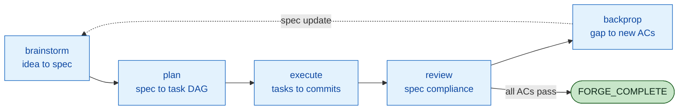
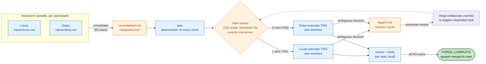
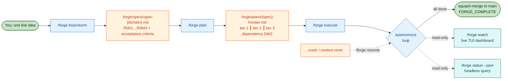
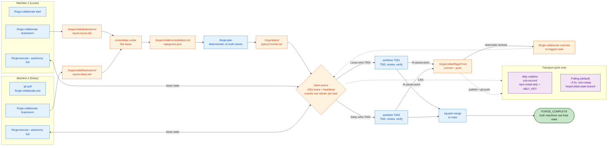
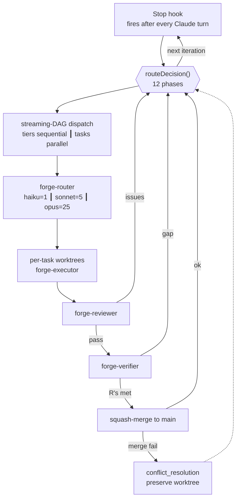
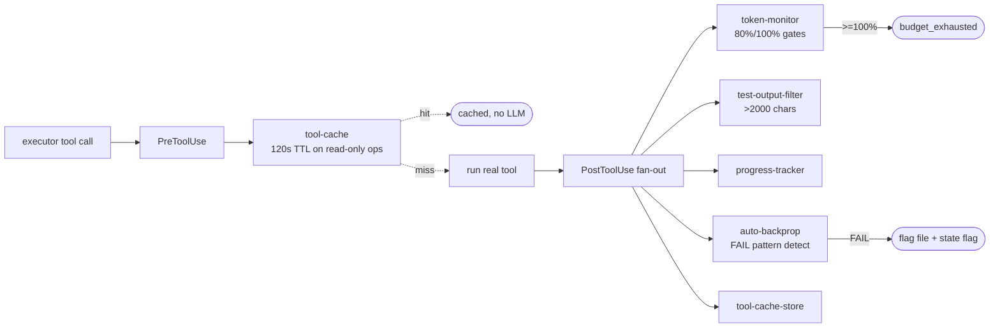
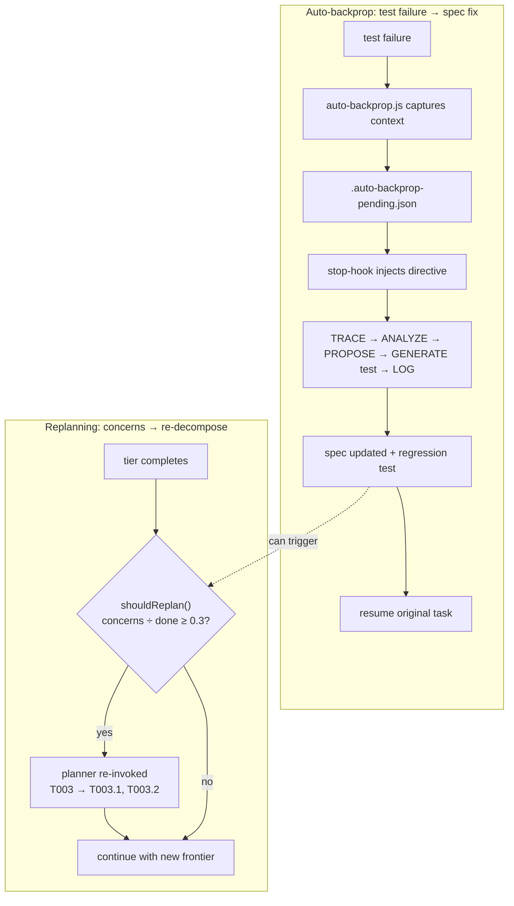
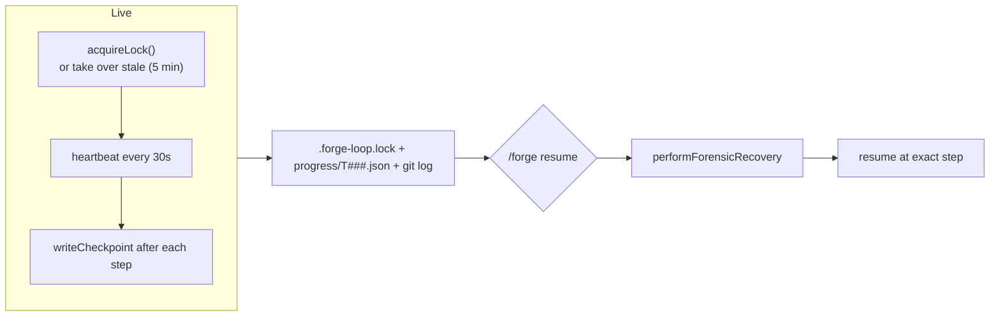
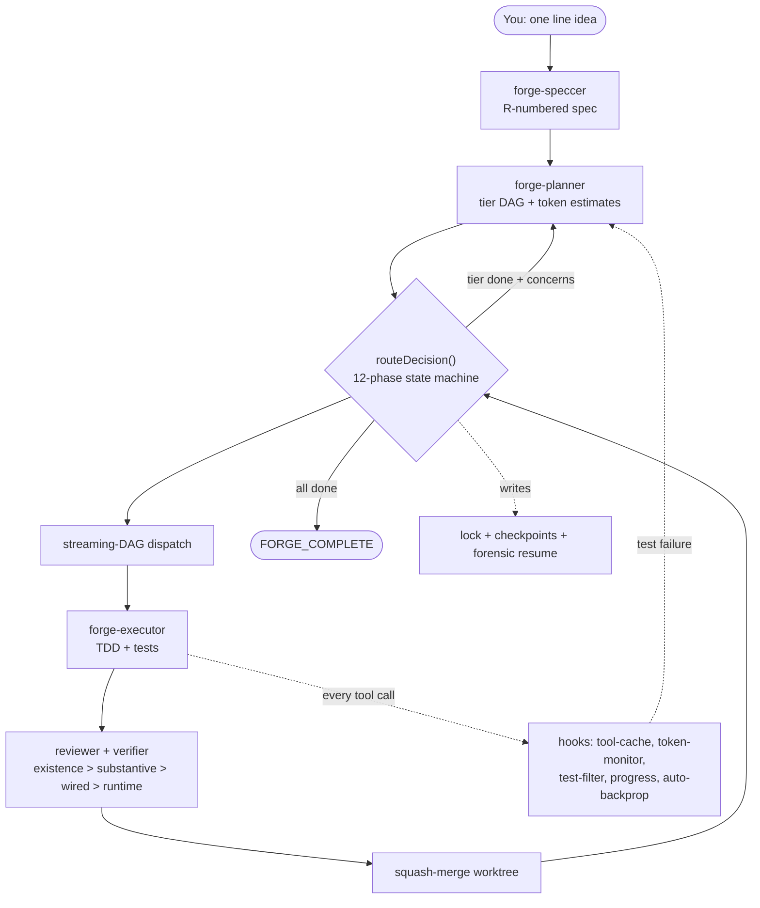

<p align="center">
  <picture>
    <source media="(prefers-color-scheme: dark)" srcset="https://raw.githubusercontent.com/LucasDuys/forge/main/docs/assets/forge-banner-dark.svg">
    <source media="(prefers-color-scheme: light)" srcset="https://raw.githubusercontent.com/LucasDuys/forge/main/docs/assets/forge-banner-light.svg">
    
  </picture>
</p>

<h3 align="center">One idea in. Tested, reviewed, committed code out.</h3>

<p align="center">
  <a href="https://github.com/LucasDuys/forge/blob/main/LICENSE"></a>
  <a href="https://github.com/LucasDuys/forge/stargazers"></a>
  <a href="https://github.com/LucasDuys/forge/releases"></a>
  <a href="https://github.com/LucasDuys/forge/tree/main/docs"></a>
  <a href="https://lucasduys.github.io/forge/"></a>
</p>

<p align="center">
  <a href="https://lucasduys.github.io/forge/">Watch the architecture video</a>
  &nbsp;·&nbsp;
  <a href="docs/">Read the docs</a>
</p>

---

You start a feature in Claude Code. You write the prompt. It writes the code. You review it. You re-prompt. It tries again. It loses context. You re-explain. You watch the "context: 87%" warning crawl up. You restart. You re-explain again. You're three hours in, you have half a feature, and you're the one keeping the whole thing from falling apart.

You are the project manager. You are the state machine. You are the glue.

**Forge replaces you as the glue.** You describe what you want in one line. Forge writes the spec, plans the tasks, runs them in parallel git worktrees with TDD, reviews the code, verifies it against the acceptance criteria, and commits atomically. You read the diffs in the morning.

**Building with a teammate?** The coordination problem is the same class of work as being-the-glue, just distributed: whose spec wins, who picks up which task, whose laptop is claiming what right now, who has to wait for whom to wake up and approve an ambiguous library choice. `/forge:collaborate` extends the same pipeline to N>=2 machines: everyone brain-dumps into one consolidated spec (under lease, no overwrites), the same plan lands deterministically on every clone, tasks are claimed across machines via a lease queue where exactly one machine wins per task, and AI decisions that would normally pause for approval become **forward-motion flags** — written + committed + pushed, executed with the AI's defended default, reviewable and overridable async by your teammate. Execute never blocks. No server, no invite link, no shared secret: session identity is a hash of `git remote get-url origin`, so anyone who can pull the repo is automatically in the session.

## What Forge is, in one minute

- **A native Claude Code plugin** you install with two commands. Lives in your existing session, no separate harness, no API keys beyond Claude itself.
- **A spec-driven autonomous loop.** `brainstorm` turns an idea into an R-numbered spec with testable acceptance criteria. `plan` decomposes the spec into a task DAG with token estimates. `execute` runs each task in its own git worktree with TDD, reviews it against the R-numbers, verifies it four ways (existence > substantive > wired > runtime), and squash-merges on pass.
- **A state machine, not a while-loop.** The Stop hook fires `routeDecision()` after every Claude turn and picks the next phase based on `.forge/state.md`. Crashes, context resets, and OOMs are recoverable because state lives on disk, not in a conversation window.
- **A distributed claim queue for teams.** `/forge:collaborate` turns the same state machine into a coordination substrate for 2+ machines: shared brainstorm, shared spec, shared task queue, shared forward-motion flags — all in `.forge/collab/` committed to git, coordinated via either polling (zero-setup, ~2.5s) or Ably (realtime, sub-second, opt-in).
- **The problem it solves.** Solo: you stop being the project manager between Claude turns. Team: you stop blocking on each other for AI-decision approvals, because every blocking decision becomes a committed flag with a default, not a paused prompt.

## Install

Two minutes. Requires Claude Code v1.0.33+. Zero npm install, zero build step, zero dependencies for the solo path.

```bash
claude plugin marketplace add LucasDuys/forge
claude plugin install forge@forge-marketplace
```

That's all you need for single-user autonomous runs. For multiplayer (`/forge:collaborate`) there's a short additional step — see [Setup from scratch](#setup-from-scratch) below.

### Setup from scratch

Fresh machine, no prior Claude Code install? The whole path, top to bottom:

1. **Install Claude Code.** Follow the [official install guide](https://docs.claude.com/claude-code/overview). Confirm `claude --version` is v1.0.33 or newer.
2. **Install Forge.** The two commands above. Confirm with `claude plugin list` — you should see `forge` in the marketplace cache.
3. **Land in a project with a git origin.** `cd` into a repo whose `git remote get-url origin` returns a real URL. Forge uses that URL for session IDs when collab mode is enabled, and for worktree isolation always.
4. **(Optional) Pick a transport for multiplayer work.** Skip this if you're only using solo mode.
   - **Zero-setup path:** nothing to install. `/forge:collaborate start --polling` uses a dedicated `forge/collab-state` git branch as the coordination substrate, ~2.5s cross-machine latency.
   - **Realtime path (Ably):** `npm install ably` in your project, grab a free API key from [ably.com/sign-up](https://ably.com/sign-up), then `export ABLY_KEY="<your-key>"`. Sub-second latency, 6M messages/month on the free tier. The `ably` package is declared an OPTIONAL peerDependency, so Forge only requires it when you actually pick realtime.
5. **Run your first spec.** See [Quickstart — solo](#quickstart) below. The solo path works without any of the optional bits above.

No state is written anywhere outside `.forge/` in your project, so uninstalling is `rm -rf .forge` and `claude plugin uninstall forge`.

## Quickstart

### Solo mode

Three commands. One autonomous loop. One squash-merge to main.

```bash
/forge brainstorm "add rate limiting to /api/search with per-user quotas"
/forge plan
/forge execute --autonomy full
```

Then walk away. Here is what you actually see while Forge runs.

```
$ /forge brainstorm "add rate limiting to /api/search with per-user quotas"

[forge-speccer] generating spec from idea...
spec written: .forge/specs/spec-rate-limiting.md
  R001  per-user quotas, configurable per tier (free / pro / enterprise)
  R002  sliding window counters (1 minute, 1 hour, 1 day)
  R003  429 response with Retry-After header
  R004  bypass for admin tokens
  R005  redis-backed counters with atomic increment
  R006  structured logs for rate-limit events
  R007  integration test against /api/search

$ /forge plan

[forge-planner] decomposing into task DAG...
8 tasks across 3 tiers (depth: standard)
  T001  add redis client + connection pool          [haiku, quick]
  T002  implement sliding window counter            [sonnet, standard]
  T003  build rate-limit middleware                 [sonnet, standard]
  T004  wire middleware to /api/search route        [haiku, quick]
  T005  add 429 response with Retry-After           [haiku, quick]
  T006  admin token bypass                          [haiku, quick]
  T007  structured logging                          [haiku, quick]
  T008  integration test                            [sonnet, standard]
        deps: T001 T002 T003 T004 T005 T006 T007

$ /forge execute --autonomy full

══ FORGE iteration 3/100 ══════════════════════════════════ phase: executing ══
  Task    T002  [in_progress]  @ tests_written → tests_passing
  Tasks   [████████░░░░░░░░░░░░░░░░░░░░░░░░░░░░░░░░] 1/8 (12%)
  Tokens  47k in / 12k out / 23k cached   budget 47k/500k (9%)
  Per-task 8k/15k tok (53%)
  Lock    alive pid 18432, 4s ago   restarts 0/10
──────────────────────────────────────────────────────────────────────

[14:02:48] T001 PASS   4 lines,  1 commit,  budget 1820/5000
[14:02:48] T002 T003 dispatched in parallel (disjoint files)
[14:06:01] T003 PASS   62 lines, 8 tests,   budget 13880/15000
[14:08:27] tier 2 complete,  squash-merged 6 worktrees
[14:14:18] forge-verifier: existence > substantive > wired > runtime
[14:14:18] verifier PASS   all 7 requirements satisfied
[14:14:18] <promise>FORGE_COMPLETE</promise>

8 tasks. 12 minutes. 218 lines. 9 commits squash-merged to main.
session budget: 47200 / 500000 used. lock released.
```

You read the diffs. You merge the branch. You move on.

The pipeline is strictly sequential, enforced programmatically: `brainstorm` → `plan` → `execute`. You cannot skip brainstorming, skip planning, or bypass the approval gate. The spec is the contract. Every acceptance criterion has an R-number; every task maps to at least one R-number; the verifier checks R-numbers, not checklists.

### Team mode (two or more participants)

Same pipeline, with a shared brainstorm and a distributed claim queue so two people on two machines can drive separate tasks in parallel without stepping on each other.

```bash
# Machine 1 (host)
/forge:collaborate start              # derives session ID from the origin URL
/forge:collaborate brainstorm         # chat-mode dump, writes inputs-<you>.md
git push                              # share your input

# Machine 2 (teammate, same repo cloned)
git pull
/forge:collaborate join               # same origin URL = same session id, automatic
/forge:collaborate brainstorm         # their own input file, no merge conflict

# Either machine
/forge:collaborate consolidate        # merges all inputs into a single spec under lease
/forge:plan                           # deterministic; both machines produce the same frontier
/forge:execute --autonomy full        # each machine claims a different task via the claim queue
```

No invite link, no OAuth, no secret to share — **the session ID is derived from `git remote get-url origin`, so anyone who can pull the repo is automatically in the same session.** All shared coordination state (brainstorm inputs, consolidated spec, claim queue, forward-motion flags) is files under `.forge/collab/`, committed to git on every change. A late joiner catches up with `git pull`; an offline teammate catches up when their laptop comes back online.

## Solo vs Team — when to use `/forge:collaborate`

**Use solo mode** (`/forge:brainstorm` → `/forge:plan` → `/forge:execute`) when:
- You are the only contributor on this feature
- You want the tightest feedback loop — no consolidation step, no claim queue overhead
- You don't need other humans to see or override AI decisions in flight

**Use team mode** (`/forge:collaborate`) when:
- Two or more people are building the same feature at the same time
- You want AI decisions that would normally pause for your input to become **forward-motion flags** that your teammate can review and override async, so execute never blocks
- You want a durable audit trail of who did what — every claim, flag, and override is a git commit with a timestamp and a handle

**Hybrid tip.** You can brainstorm collaboratively (a consolidated spec captures everyone's requirements) and then execute solo. Or vice-versa: one person writes the spec, two people execute it in parallel. `/forge:collaborate` is opt-in per-phase, not all-or-nothing.

## Collaborative mode in depth

The mechanics are worth knowing because they shape how the day goes.

**Session identity.** `sessionIdFromOrigin()` hashes your repo's origin URL into a 12-hex code. All participants with the same clone derive the same code without any shared secret. Re-pointing origin to a different URL creates a new session; `/forge:collaborate recover` detects this as `session_mismatch` and offers a migration.

**Transports.** Two backends satisfy the same interface:
- **Polling (zero-setup, default):** coordination via the `forge/collab-state` git branch, updated every ~2.5s. No API keys, no npm installs.
- **Ably (realtime, opt-in):** sub-second latency via WebSockets. Requires `npm install ably` and `export ABLY_KEY=...`. Forge picks this automatically when `ABLY_KEY` is in env; `--polling` forces the git path even when a key is present.

**What's shared, what's local.** The `.forge/collab/` directory is carved out of the default `.forge/` gitignore so its contents propagate via git. Inside that directory:
- `brainstorm/inputs-<handle>.md` — **shared** (one per participant, no merge conflicts because each file is user-scoped)
- `consolidated.md`, `categories.json` — **shared**, written under a consolidation lease so two people can't overwrite each other
- `flags/F<id>.md` — **shared** (forward-motion flags committed on write)
- `participant.json`, `.enabled`, `flag-emit-log-<handle>.jsonl` — **local per-machine** (re-ignored by a nested `.forge/collab/.gitignore`)

**Claim queue.** `claimTask(transport, taskId, handle)` acquires a lease with a 120-second TTL and automatic heartbeat refresh. Parallel claims on the same task resolve via a publish-ack election (realtime) or a git-CAS (polling) — **exactly one wins**, the other gets `{acquired:false, reason:'lost_race', holder:<winner>}`. Lease expires if the claimant's session dies; the task returns to the claimable pool.

**Forward-motion flags.** During `/forge:execute`, any time the AI would pause for human input (an ambiguous decision, a library choice, an architectural tiebreaker), it picks a default, writes `flags/F<id>.md` with the decision + alternatives + rationale, commits + pushes, and keeps going. Your teammate on the other machine can review open flags with `/forge:collaborate flags`, override with `/forge:collaborate override F<id> "<new decision>"`, and the dependent task re-triggers on the next iteration. Execute is never blocked waiting for you to wake up.

**Crash recovery.** `participant.json` writes first, `.enabled` writes last as the atomic "collab on" marker. `leave` reverses that order. Any crash between the two flips leaves a partial state that `/forge:collaborate recover` classifies (`stale_participant` / `stale_enabled` / `session_mismatch`) and repairs with one command.

Full subcommand reference: [docs/collaborate.md](docs/collaborate.md).

## How Forge Actually Works

Forge runs five phases in a loop. Four of them always run in order. The fifth, `backprop`, fires whenever a later phase catches a bug the spec did not anticipate, and its output feeds back into the first phase.

### Solo mode — phase loop



Each phase has one owner agent, one input artifact, and one output artifact. The state file `.forge/state.md` records which phase is active; the Stop hook fires `routeDecision()` after every Claude turn and picks the next phase based on that state.

### Team mode — the same phases, distributed

`/forge:collaborate` keeps the phases identical but distributes ownership across machines. Every shared artifact is a file in `.forge/collab/` committed to git, and every concurrent operation (consolidation, claim, flag emit) is gated by a lease the transport resolves with **exactly one winner**.



The two-paragraph read: **(1)** brainstorm is parallel and non-conflicting because each participant writes to a user-scoped filename (`inputs-<handle>.md`) — no merge conflict by construction; consolidation into `consolidated.md` is serialized behind a 30-second lease. **(2)** Plan is a pure function of the spec so both machines produce the same frontier independently; execute then races for task claims via a 120-second lease (auto-heartbeated every 30s), and every AI pause-point becomes a committed forward-motion flag that your teammate can override without blocking execute.

### Worked example: add a logout button

```bash
/forge:brainstorm "add a logout button to the header that clears the session and redirects to /login"
```

The speccer asks three to seven questions one at a time (does logout also revoke refresh tokens, should it confirm first, where in the header). It writes `.forge/specs/spec-logout-button.md` with R001 through R004 and acceptance criteria for each.

```bash
/forge:plan
```

The planner decomposes the spec into a dependency-ordered task DAG, written to `.forge/plans/spec-logout-button-frontier.md`. For this spec that is usually T001 add `POST /auth/logout` route, T002 build `<LogoutButton>` React component, T003 wire the button into the header, T004 e2e test covering the happy path and the already-logged-out case.

```bash
/forge:execute --autonomy gated
```

The executor runs each task in its own git worktree under `.forge/worktrees/T00N/`. For T002 it writes `src/components/LogoutButton.tsx` and `src/components/__tests__/LogoutButton.test.tsx`, runs the targeted tests, then the reviewer checks the change against R002's ACs. Passing tasks squash-merge to the branch with a structured commit message. Failing tasks stay in their worktree for `/forge:resume` or `/forge:backprop` to pick up.

### What Forge does automatically vs what requires your explicit approval

| Action | `gated` (default) | `full` |
|---|---|---|
| Write spec from your one-line idea | automatic (asks you questions during Q&A) | automatic |
| Decompose spec into tasks | automatic | automatic |
| Write code + tests for each task | automatic | automatic |
| Run tests, review, verify each task | automatic | automatic |
| Squash-merge passing tasks to the working branch | automatic | automatic |
| Install a new dependency not already in the manifest | pauses and asks | assumes prior consent, installs |
| Hit a paid API (Stripe, OpenAI beyond Claude) | pauses and asks | assumes prior consent, calls |
| Push to a remote | pauses and asks | pauses and asks (both modes require explicit approval) |
| Run destructive git ops (force push, reset --hard) | refuses unless the spec explicitly requests | refuses unless the spec explicitly requests |
| Propose a spec update when tests hit a gap | automatic (backprop proposal in `.forge/backprop-log.md`) | automatic, applied immediately on high-confidence gaps |

The headline difference: `full` mode assumes you already authorized the side-effect class when you ran `/forge:execute --autonomy full`, so it does not pause again. It still refuses destructive git ops and it still pauses before pushing.

### When `<promise>FORGE_COMPLETE</promise>` fires but the feature is broken

The completion promise is a structural gate. Tasks done, tests green, reviewer satisfied, verifier satisfied. A feature that passes all four can still look visibly broken in the browser (blurred canvas, empty panel, wrong state after a click) because unit and integration tests do not render pixels. Three recipes when that happens.

**Visual smoke test first.** Open the dev server and click through the feature by hand for 90 seconds. Note exactly what is wrong in plain language. A single sentence like "clicking logout shows the login page for a frame then flashes back to the dashboard" is enough for backprop to work.

**Then `/forge:backprop "<what-is-wrong>"`.** The backprop command traces the bug to the R-number whose acceptance criteria should have caught it, proposes a new or tightened acceptance criterion, and generates a regression test that would have failed against the shipped code. You approve the spec update; the regression test runs; fix work picks up automatically.

**If backprop cannot locate the gap, manual spec review.** Open `.forge/specs/spec-<domain>.md` and read the acceptance criteria against the behavior you saw. Criteria written as "feature exists" or "tests pass" are the usual culprits. Rewrite them as observable behaviors ("after clicking logout the URL becomes `/login` and the session cookie is cleared"), then rerun `/forge:execute` on the updated spec.

Full backprop workflow: [docs/backpropagation.md](docs/backpropagation.md). Visual verification gate (planned for 0.3, spec-forge-v03-gaps R007): [docs/superpowers/specs/spec-forge-v03-gaps.md](docs/superpowers/specs/spec-forge-v03-gaps.md).

### Where to go next

- [docs/mechanics/commands-reference.md](docs/mechanics/commands-reference.md): every slash command, one table
- [docs/mechanics/token-savings.md](docs/mechanics/token-savings.md): the five mechanisms that keep a long run inside budget
- [docs/mechanics/subsystem-reference.md](docs/mechanics/subsystem-reference.md): where each subsystem lives in the repo
- [docs/architecture.md](docs/architecture.md): deeper walkthrough with four detail diagrams

## Why Forge

Six outcomes, each traceable to a mechanism.

- **No silent token overruns at 3am.** Per-task and session budgets are hard ceilings, not warnings. At 100% the state machine transitions to `budget_exhausted`, writes a handoff at `.forge/resume.md`, and stops cleanly. Resume picks up where it died, no re-explaining. [budgets](docs/budgets.md)
- **Failed tasks never touch your main branch.** Every task runs in its own git worktree. Success squash-merges with a structured commit message. Failure discards the worktree; main stays green. [worktrees](docs/worktrees.md)
- **Crashes survive.** Lock file with heartbeat, per-step checkpoints, forensic resume from the git log. Machine reboots mid-feature, `/forge resume` reconstructs phase, current task, completed tasks, orphan worktrees, and continues. No lost work, no re-running passing tests. [recovery](docs/recovery.md)
- **Verification checks the spec, not the checklist.** Four levels: existence, substantive (not a stub), wired (imported where used), runtime (tests pass, webhooks handle, CI green). Catches "looks done but isn't" before it ships. [verification](docs/verification.md)
- **Headless-ready.** Proper exit codes, JSON state query in ~2ms, zero interactive prompts. Drop `/forge status --json` into Prometheus or a cron job. [headless](docs/headless.md)
- **Native Claude Code plugin.** Lives in your session. No separate harness, no TUI to learn, no API key to manage. Install in two minutes. [architecture](docs/architecture.md)

### Automatic backpropagation

One of Forge's more novel ideas. When the executor's tests fail, a PostToolUse hook catches it and trips a flag. The next iteration runs a five-step workflow before resuming the failing task:

1. **Trace.** Which spec and R-number does this failure map to?
2. **Analyze.** Is the gap a missing criterion, an incomplete one, or a whole missing requirement?
3. **Propose.** A spec update for your approval.
4. **Generate.** A regression test that would have caught it.
5. **Log.** Record in `.forge/backprop-log.md`; after three gaps in the same category, suggest systemic changes at the brainstorming layer.

The failure becomes a better spec, not just a fixed bug. Opt out with `auto_backprop: false` in `.forge/config.json` or `FORGE_AUTO_BACKPROP=0`. Manual invocation is `/forge backprop "description"`. Full detail in [backpropagation](docs/backpropagation.md).

### What Forge does vs what you do

The detailed autonomy-vs-approval breakdown lives in the "How Forge Actually Works" section above; the per-phase ownership table is in [docs/architecture.md](docs/architecture.md).

## How Forge saves tokens

Five mechanisms keep a long autonomous run inside its budget: hard per-task and session budgets, caveman compression on internal agent artifacts, a 120-second tool-call cache, a test-output filter that keeps only failure blocks, and optional graphify-aware context scoping. Full reference with measured numbers: [docs/mechanics/token-savings.md](docs/mechanics/token-savings.md).

## How it compares

Three tools solve overlapping problems. The right choice depends on what you value.

| | Forge | Ralph Loop | GSD-2 |
|---|---|---|---|
| **Core model** | Native Claude Code plugin, streaming DAG, state machine | Re-feed same prompt in a while loop | Standalone TypeScript harness on Pi SDK |
| **State** | Task DAG, lock file, per-task checkpoints, token ledger | One integer (`iteration`) + active flag | External state machine in TypeScript |
| **Decomposition** | Spec → R-numbers → task DAG, adaptive depth | None; Claude infers from files | Milestone → slice → task |
| **Cost controls** | Per-task + session token budgets, hard ceilings | None built in | Per-unit ledger with ceilings |
| **Git isolation** | Per-task worktrees with squash-merge | None | Worktree per slice |
| **Crash recovery** | Lock + forensic resume from checkpoints + git log | None | Lock files + session forensics |
| **Verification** | Goal-backward (existence > substantive > wired > runtime) | Whatever the prompt says | Auto-fix retries on test/lint |
| **Setup** | `claude plugin install` | Built into Claude Code | `npm install -g gsd-pi` |

- Pick **Forge** if you want autonomous execution inside your existing Claude Code session with hard cost controls, adaptive depth, and crash recovery.
- Pick **GSD-2** if you want a battle-tested standalone TUI harness with more engineering hours behind it.
- Pick **Ralph Loop** if you have a tightly-scoped greenfield task with binary verification and want the absolute minimum infrastructure.

Full honest comparison with all trade-offs: [docs/comparison.md](docs/comparison.md).

## How it works under the hood

Forge is a state machine that lives inside your Claude Code session. A spec becomes a tier-ordered task DAG; an autonomous loop dispatches parallel executors in git worktrees; each task is gated by review and verification; successful tasks squash-merge atomically. Seven hooks fire on every tool call to cap tokens, condense test output, cache repeat reads, track progress, and trigger auto-backprop when tests hit a spec gap. State files under `.forge/` are the single source of truth; the TUI and headless query both read them without writing.

### The big picture — solo

End-to-end. Three commands, one autonomous loop, one merge.



### The big picture — team (`/forge:collaborate`)

Same three phases, distributed across N>=2 machines. Shared state is files in `.forge/collab/` committed to git; concurrency is resolved by leases the transport (polling or Ably) adjudicates with exactly one winner per contested operation. No server, no invite link — session identity is `sessionIdFromOrigin()`, a 12-hex hash of `git remote get-url origin`.



How to read it in order: **(1)** both machines join the session by deriving the same ID from the same origin — no invite, no OAuth. **(2)** Brainstorm is per-participant with user-scoped filenames, so two people writing at once never conflict; consolidation is serialized behind a 30-second lease. **(3)** Plan is pure over the spec, so each machine produces the same frontier independently. **(4)** Execute races for claims through a lease the transport adjudicates (Ably: publish-ack election; polling: commit-rebase CAS) — the loser gets `{acquired:false, reason:'lost_race'}` and picks a different task. **(5)** Any AI decision that would normally pause for human approval is instead committed as a flag with the AI's defended default; your teammate can override it later and the dependent task re-triggers on the next iteration. **(6)** Every merged task is a normal squash-merge to main; the collab state evaporates on `/forge:collaborate leave`.

Four deeper diagrams cover the execute loop, hooks pipeline, backpropagation, and recovery layer. A fifth block lists the collaborative mode's lifecycle invariants and recovery classes. Click any to expand. The full one-piece view sits at the bottom.

<details>
<summary><strong>Execute loop (state machine + DAG dispatch)</strong></summary>

What `/forge execute` actually runs. State machine drives everything; the Stop hook re-fires it after every Claude turn.



</details>

<details>
<summary><strong>Hooks pipeline (every tool call)</strong></summary>

Seven hooks fire on every executor tool call. They keep the loop fast, cheap, and self-correcting.



</details>

<details>
<summary><strong>Backpropagation and replanning loops</strong></summary>

Two feedback loops that change what runs next based on what just happened.



</details>

<details>
<summary><strong>Recovery layer</strong></summary>

Three independent layers cooperate so nothing is lost.



</details>

<details>
<summary><strong>Collaborative mode — lifecycle invariants and crash classes</strong></summary>

The big-picture team diagram above shows the happy path. These are the non-obvious invariants that make the mode crash-safe, plus the five classes `/forge:collaborate recover` diagnoses.

**Atomicity through filesystem ordering.** Collab-on and collab-off are each a two-write sequence with the user-visible marker flipped atomically last (on entry) or first (on exit). A crash between writes is always recoverable.

- **Start order:** `participant.json` FIRST (handle, session ID, start time), then `.enabled` LAST as the atomic "collab on" flip. A crash between them leaves `stale_participant`.
- **Leave order:** `.enabled` FIRST (atomic "collab off"), then release active claims, then transport disconnect, then `participant.json` LAST. A crash between them leaves `stale_enabled` but the executor guard has already stopped treating the machine as a participant.

**Lease hierarchy.** Three disjoint leases, each with a distinct TTL.

- **Consolidation lease — 30s TTL.** Prevents two machines from overwriting `consolidated.md` during the merge step. Holder keeps the lease until write completes.
- **Claim lease — 120s TTL, auto-heartbeat every 30s.** One winner per task; a dropped laptop's claim expires and the task returns to the claimable pool. `tryAcquireLease` is async and awaits the transport CAS (fixed in R010 — see `tests/collab-claim-race.test.cjs`).
- **Flag emit — no lease.** Flags are fire-and-forget: write, commit, push, keep executing. Overrides are just another commit on top.

**Recovery classes.** `/forge:collaborate recover` (dry-run by default, `apply:true` to commit) classifies the on-disk state and proposes a remedy.

| Class | State | Remedy |
|---|---|---|
| `inactive` | Neither marker present | No action |
| `healthy` | Both markers, session matches origin | No action |
| `stale_participant` | `participant.json` present, `.enabled` missing | Reset partial start |
| `stale_enabled` | `.enabled` present, `participant.json` missing | Repair from git config |
| `session_mismatch` | Both present, participant's session_id differs from current origin hash | Migrate participant to new session |

**Transport requirements.** Polling has zero extra deps; Ably realtime requires `npm install ably` + `export ABLY_KEY=...`. `ably` is declared an OPTIONAL peerDependency, so the plugin only pulls it when `ABLY_KEY` is in env and `--polling` is not forced.

**Shared vs local files.** `.forge/collab/` is carved out of the default `.forge/` gitignore so its contents propagate via git; a nested `.forge/collab/.gitignore` re-ignores per-machine markers (`participant.json`, `.enabled`, `flag-emit-log-<handle>.jsonl`). `detectLegacyGitignore` + `patchGitignore` migrate old checkouts.

</details>

<details>
<summary><strong>Full one-piece architecture diagram</strong></summary>

All subsystems in one flow. The four focused diagrams above are easier to read individually; this is the holistic view. GitHub's "click to expand" button renders it at full size.



</details>

### Subsystem reference

Eight subsystems (state machine, DAG dispatch, model routing, budget tracking, agents, hooks, recovery, TUI + headless). Full table with file pointers: [docs/mechanics/subsystem-reference.md](docs/mechanics/subsystem-reference.md).

## Receipts

- **691 tests across 54 suites, 0 runtime dependencies.** Full suite runs in ~40 seconds. Pure `node:assert`, zero npm install for the solo path. (`ably` is an optional peerDependency, only needed for realtime collab mode.)
- **Headless state query: ~2ms.** Zero LLM calls, 17-field versioned JSON schema.
- **Caveman compression: 12% measured** on the 10-scenario agent-output benchmark at full intensity, rising to 18% at ultra and up to 65% on dense prose. [benchmark](docs/benchmarks/caveman-integration.md)
- **Seven hooks fire on every tool call.** Tool cache, token monitor, test filter, progress tracker, auto-backprop, cache store, stop. See [architecture](docs/architecture.md).
- **Seven circuit breakers.** Test failures, debug exhaustion, Codex rescue, re-decomposition, review iterations, no-progress detection, max iterations. Nothing runs forever. [verification](docs/verification.md)
- **Lock heartbeat survives** crashes, reboots, OOMs, and context resets. Five-minute stale threshold, never auto-deletes user work.
- **Seven specialized agents**, each routed to the cheapest model that can handle the job. [agents](docs/agents.md)
- **Streaming-DAG scheduler with publish-ack CAS.** Claim mutex resolves parallel races via election, not optimistic retries. Lease TTL 120s with auto-heartbeat. Worst-case rollback = 12 min per task; net streaming speedup 43% on a 5-task chain. [benchmark](docs/benchmarks/streaming-dag-vs-task-dag.md)
- **Origin-derived session IDs.** `/forge:collaborate` requires no invite links, no OAuth, no shared secrets — anyone who can `git pull` the repo is automatically in the same session.

Cross-cutting skills influencing every agent: **Karpathy Guardrails** (four behavioral principles, flagged by the reviewer), **Graphify Integration** (optional knowledge-graph context), **DESIGN.md Support** (design-system compliance pass enforced at brainstorm-time when a brand-based aesthetic is chosen), and **Caveman internal-artifact compression**. Details in [docs/superpowers/](docs/superpowers/).

## Documentation

- [Architecture](docs/architecture.md): three-tiered loop, self-prompting engine, collaborative mode
- [Commands](docs/commands.md): every slash command and flag
- [Collaborate](docs/collaborate.md): multiplayer mode — session identity, transports, claim queue, flag override
- [Configuration](docs/configuration.md): `.forge/config.json` reference
- [Token budgets](docs/budgets.md): per-task and session ceilings
- [Caveman optimization](docs/caveman.md): internal token compression modes
- [Worktree isolation](docs/worktrees.md): how each task gets its own branch
- [Crash recovery](docs/recovery.md): forensic resume from checkpoints
- [Verification and circuit breakers](docs/verification.md): goal-backward verification and the seven safety nets
- [Backpropagation](docs/backpropagation.md): test failures to spec gaps
- [Headless mode](docs/headless.md): CI and cron usage, JSON schema
- [Specialized agents](docs/agents.md): the seven roles and model routing
- [Live dashboard](docs/dashboard.md): `/forge watch` interactive TUI
- [Testing](docs/testing.md): running the test suite
- [Comparison](docs/comparison.md): Forge vs Ralph Loop vs GSD-2

## Credits

- **Caveman skill** adapted from [JuliusBrussee/caveman](https://github.com/JuliusBrussee/caveman) (MIT)
- **Ralph Loop pattern** by [Geoffrey Huntley](https://ghuntley.com/ralph/); Forge's self-prompting loop is a smarter-state-machine variant
- **Spec-driven development** concepts from GSD v1 by TÂCHES
- **Karpathy guardrails** from [andrej-karpathy-skills](https://github.com/forrestchang/andrej-karpathy-skills)
- **Claude Code plugin system** by Anthropic; Forge is a native extension, not a wrapper

## Contributing

1. Fork the repository
2. Create a feature branch
3. Make your changes
4. Run tests: `node scripts/run-tests.cjs`
5. Open a pull request

See [CONTRIBUTING.md](CONTRIBUTING.md).

## License

[MIT](LICENSE)
