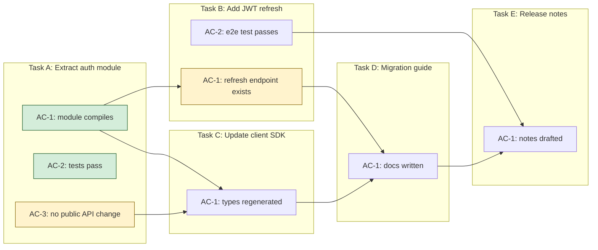

# Streaming DAG Research — Forge v0.3

Research notes for the streaming DAG feature: downstream tasks start the moment the specific upstream acceptance criteria they depend on are satisfied, rather than waiting for whole-task completion. Compiled for authoring R-numbered acceptance criteria.

## 1. Landscape

How production systems express dependencies finer than "task complete":

| System | Primitive | Granularity | How downstream triggers | Rollback on upstream regression |
|---|---|---|---|---|
| Airflow | Datasets + deferrable triggers | Per-dataset-URI event | DAG A emits `outlets=[Dataset("x")]`; DAG B is `schedule=[Dataset("x")]`. Triggerer async-polls; worker slot freed during wait | No automatic rollback — new upstream run produces new event; B re-runs on next event |
| Dagster | Asset graph + partitions + `AutomationCondition` | Per-asset × per-partition | `AutomationCondition.any_deps_updated()` fires when any upstream partition materializes; asset observations can trigger without re-materializing | Data versions on assets; staleness propagates; no true rollback, only "unsynced" marking |
| Prefect | Result-based futures + dynamic task mapping | Per-future / per-mapped-item | `.map(upstream_result)` spawns one downstream per element as items land; each has its own retry lifecycle | Per-task retry; no cross-task rollback |
| Temporal | Signals + Update-With-Start + child workflows | Per-signal | Parent sends Signal to child the moment a milestone is reached; children can start Update-with-Start to get a sync response while the main workflow continues | Deterministic replay from event history; compensation via Saga pattern is explicit user code |
| Nextflow | Typed channels (queue / value) | Per-emit (one item at a time) | Queue channels are async FIFO; a process consumes items as they arrive, produces outputs that feed the next channel | Re-run invalidates downstream that consumed stale items; `-resume` uses content hashes |
| Snakemake | `checkpoint` rules | Per-output-file | DAG is re-evaluated after each checkpoint; input functions re-read globs once checkpoint finishes; replaces deprecated `dynamic()` flag | File-hash-based; downstream sees new input, re-runs |
| Make / Ninja | File mtime / content hash | Per-file | Any downstream rule whose `prerequisites` changed is re-evaluated immediately | Bottom-up rebuild |
| LangGraph | State channels + reducers + `Send` + `Command` | Per-channel-key | A node returns a partial state update on one channel; any edge reading that channel fires. `Send()` dispatches work dynamically, `Command` combines update+route | No rollback; state is append-only per reducer; on failure you must persist and re-enter |
| Bazel / Nix | Content-addressable Merkle graph | Per-action-input-hash | Any action whose transitive input hash changes is re-run | Hash change → cache miss → re-run; old outputs stay content-addressed |
| Sherlock (MLSys 2026) | Step DAG + speculative execution + selective verifiers | Per-step (not per-AC) | Downstream proceeds optimistically; verifier runs async in parallel; if it fails, roll back to last verified output | Explicit rollback to last verified step; 18.3% accuracy gain, up to 48.7% faster |

Most mature, closest fit: **Dagster's asset + partition + AutomationCondition model** ([docs](https://docs.dagster.io/guides/automate/declarative-automation)). It already expresses "this sub-unit of work is done, fire downstream that depends on this sub-unit" — swap "partition" for "acceptance criterion" and the mapping is almost 1:1.

Closest agent-specific precedent: **Sherlock** ([arXiv 2511.00330](https://arxiv.org/abs/2511.00330)) — the only paper I found that explicitly does speculative execution with rollback for agentic workflows. It's step-level, not AC-level, so Forge would extend it.

## 2. Recommended design for Forge

Pick: **Dagster's AutomationCondition model, applied at AC granularity, with Sherlock-style speculative + verified execution.**

Why:

1. AC-as-partition is the right mental model. A task is an asset; each AC is a partition of that asset. Downstream tasks declare dependencies on specific upstream (task, AC) pairs, not on whole tasks.
2. The trigger primitive is an event: "AC-X of task-A is resolved". Any downstream whose `depends_on` includes `A.AC-X` and has all its other AC-deps resolved becomes eligible.
3. Speculative execution on top (Sherlock) handles the LLM regression problem: B starts the instant `A.AC-X` first reports resolved, but B's result is held in a *provisional* state until A is fully DONE. If A later regresses AC-X, B is invalidated.
4. This degrades gracefully: if the spec author doesn't annotate AC-level dependencies, the system falls back to today's per-task behavior.

Concrete primitive in `.forge/state.md` frontmatter or a new `frontier.json`:

```yaml
tasks:
  - id: A
    acs: [A.AC-1, A.AC-2, A.AC-3]
  - id: B
    depends_on:
      - A.AC-1   # not just "A"
      - C.AC-2
```

## 3. Race + rollback strategy

The core risk: B starts on `A.AC-1=passed`; A later fails `A.AC-2` in a way that also invalidates `A.AC-1` (e.g. the executor rewrites the file that made AC-1 pass). B is already running, maybe already committed.

Strategy, adapted from Sherlock and from Bazel's content-addressable approach:

1. **Two states, not one**: each AC event is `provisional` (first-pass by executor) or `verified` (after the task's full review step passes). B starts on `provisional`.
2. **AC-event carries a content hash** of the files/artifacts that made it pass (the "witness set"). Store `{ac_id: A.AC-1, state: provisional, witness_hash: sha256(...)}`.
3. **Downstream task B captures the witness_hash at start**. When B completes, it records which upstream witness_hashes it consumed.
4. **On upstream verification failure** (A regresses), walk the downstream graph. For any B that consumed a now-invalid witness_hash, mark B as `speculatively_stale` and re-queue. Do not auto-merge B's commit.
5. **Commit gating**: provisional downstream work goes on a temp branch (or stays uncommitted in a worktree). Only promote to the main branch when the entire upstream chain is verified. This matches Sherlock's "retain speculative results when verification succeeds ... conservatively default to full rollback for code" [[source](https://arxiv.org/pdf/2511.00330)].
6. **Cycle-break**: if A fails verification three times, disable speculation on A's descendants and fall back to sequential. Prevents thrashing.

Anti-pattern to avoid: signaling B with *just* `{ac_id, resolved: true}`. That's what Airflow datasets do and it's what makes Airflow's data-aware scheduling unable to detect "the dataset says done but the content regressed". The witness hash is load-bearing.

## 4. Data primitive on the edge

Upstream emits, downstream consumes, a single structured event:

```json
{
  "task_id": "A",
  "ac_id": "A.AC-1",
  "state": "provisional",
  "witness_hash": "sha256:abc123...",
  "witness_paths": ["src/auth.ts", "tests/auth.test.ts"],
  "emitted_at": "2026-04-20T10:34:00Z",
  "verifier_run": null
}
```

When the task's full review passes, emit a second event with `state: "verified"` and the same `witness_hash`. If the hash changed between provisional and verified, all downstream that consumed the provisional hash is stale.

Why these fields:

- `witness_hash`: Bazel/Nix-style content addressing. Lets downstream detect silent regressions. Essential.
- `witness_paths`: Human-readable + gives the scheduler a cheap check ("did any of these files change?") before doing the hash compare.
- `state`: maps to Sherlock's speculative/verified two-phase model.
- `verifier_run`: room for Sherlock-style selective verification metadata (which verifier checked this, at what cost).

Do not pass file content or full snapshots on the edge. Keep the edge small (it goes through `state.md`); the content lives in git.

## 5. Visual rendering

Recommended: **Mermaid flowchart with nested subgraphs**, one subgraph per task, one node per AC. Edge from upstream AC-node to downstream task-node (or to a specific downstream AC-node if the spec author pins that level).

Why Mermaid: renders in GitHub, Claude Code, most markdown viewers; supports nested subgraphs and cross-subgraph edges natively ([Mermaid subgraphs docs](https://mermaid.ai/open-source/syntax/flowchart.html)); DVC and R `targets` already use it for pipeline DAGs ([DVC dag mermaid](https://dvc.org/doc/command-reference/dag), [tar_mermaid](https://docs.ropensci.org/targets/reference/tar_mermaid.html)). GraphViz is more powerful but doesn't render inline. Dagster's UI is great but requires hosting a service.

Worked example — a 5-task Forge DAG:



Yellow = provisional, green = verified. Edges cross subgraph boundaries to show per-AC dependency. Under today's per-task scheduling, C couldn't start until A was fully done; here C starts when both `A.AC-1` and `A.AC-3` are even provisionally resolved.

## 6. Open questions for the spec author

1. **Default AC-dependency mode for existing specs without annotations**: auto-infer from file overlap, require explicit `depends_on: [X.AC-n]`, or keep the old "depends on whole task" behavior as default and let users opt in? I'd pick opt-in; auto-inference is a separate feature.
2. **Granularity of the witness hash**: hash all files the AC's test touched, or hash just the files the AC's implementation edited? The former is more conservative; the latter is cheaper. Suggest starting with "files touched by the commit whose review check passed this AC".
3. **Should provisional downstream work actually commit**? Options: (a) commit to a speculative branch that gets rebased on verify, (b) keep in a worktree and only commit on full upstream verification, (c) commit to main immediately and auto-revert on invalidation. I'd pick (b) — aligns with the existing Forge worktree model and avoids revert churn.
4. **Max speculation depth**: if A is speculative and B speculates on A, and C speculates on B, how many speculative layers do we allow? Sherlock's paper doesn't bound it but notes rollback cost grows linearly. Suggest `max_speculation_depth: 2` as a config knob.
5. **Verifier placement**: Sherlock uses a learned verifier selector to decide which nodes to verify. Forge probably can't afford that in v0.3 — assume "always verify every task's ACs via the existing review step" and revisit.
6. **UI/Watch mode**: should `forge:watch` render the Mermaid graph live with provisional/verified coloring, or just stream events? The Mermaid diagram is cheap to re-render per tick; I'd include it.
7. **What counts as "AC resolved"?** Today it's the reviewer agent returning status=DONE with all ACs checked. For streaming, we need an explicit per-AC signal from the reviewer — does the reviewer prompt need to change to emit per-AC provisional-pass events during implementation, or only at the end?
8. **Cross-spec dependencies**: can `B.AC-1` depend on an AC from a *different spec*'s task? Airflow datasets support cross-DAG; Dagster asset graph does too. Suggest yes, same syntax, scheduler handles it.

---

Sources inline above. Not found in search: specific per-AC dependency granularity in AutoGen / CrewAI / Mastra / Agno / Aider / OpenHands — all operate at task or agent level, not below. OpenHands SDK supports "blocking parallel execution" via a delegation tool but sub-agents are still whole conversations ([OpenHands SDK paper](https://arxiv.org/html/2511.03690v1)). No public precedent in agent frameworks for per-acceptance-criterion dependency scheduling; Forge would be breaking ground here, with Sherlock as the closest adjacent work.
